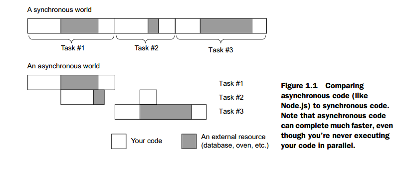

# 1.1 Node.js的职责是什么？

Node.js不是小孩的玩具。当我第一次开始使用Node.js时，我很疑惑。它到底是什么？

Node.js(通常简写为Node)是一个JavaScript平台--一种运行JavaScript的方式。大多数时候，JavaScript在浏览器运行。它是一种编程语言，就像Ruby或Python或C++或PHP或Java。当然，所有流行的web浏览器都附带了JavaScript运行环境，但这并不意味着它只能运行在浏览器。如果你要运行的是一个名为`myfile.py`的Python文件，你会运行`pyhon myfile.py`这个指令。但是你也可以编写你自己的Python解释器，称之为SnakeWoman，然后运行`snakewoman myfile.py`指令。开发者也对Node.js做了同样的事情；你需要输入`node myfile.js`而不是`javascript myfile.js`。

在浏览器之外运行JavaScript，你能做很多事情--任何一个常规编程语言能做的，都可做，真的--但是，通常用来做web开发。

好了，所以，你可以在服务器运行JavaScript代码了--但是为什么你要这么做？

许多开发者会该诉你，Node.js运行很快，没错。Node.js无论如何都不是市面上最快的，但它快有两个原因。

第一个相当简单：JavaScript引擎很快。它是基于Google Chrome浏览器使用的引擎，拥有一个极其快速的JavaScript引擎。[It can execute JavaScript like there’s no tomorrow]它能够如流水般执行JavaScript，每秒处理成千上万的指令。

第二个它快的原因是基于它处理并发的能力，[and it’s a bit less straightforward]有点不简单。它的性能来源于它的异步工作方式。

在现实生活中我能找到的最好的类比就是烘焙。假设我正在烤松饼。我需要准备面糊，当我在做这个的时候，我没办法做其他的事情。我不能坐着读书，我也没办法烹调其他食物，等等。但是一旦我将松饼放进烤箱，我就不必站宅那然后看着烤箱直到完成--我可以做其他事情。可能我开始准备更多的面糊，也可能阅读一本书。总之，我不必等到松饼烘焙完成才能去做其他事情。

在Node.js这，一个浏览器可能从你的服务器请求一些资源。你开始应答这个这个请求，然后另一个请求又来了。假设这两个请求都需要和外部的数据库进行对话。你可以询问外部数据库关于第一个请求（所需的数据），当外部数据库正在思考的时候，你就可以开始响应第二个请求。你的代码同一时间不会一次做两件事，但是当其他人在做一些事情时，你就不必等待了。

其他运行环境默认就没有这么奢华的内置（特性）了。比如，Ruby on Rails，只能在每次处理一个请求。一次处理多个请求，实际上就得购买更多服务器了（当然，许多人对这个说法表示了不同看法）

Figure 1.1 演示它看起来是什么样子的

我不是想告诉你说，Node.js是世界上最快的，由于它的异步性能。Node.js能够压榨更多cpu核心的性能，但是在多核的时候并不是很擅长。其他编程语言真的允许你积极地一次做两件事情。再次用烘焙的那个例子：其他的编程语言让你买更多的烤箱，因此你可以同事烤更多的额松饼。Node.js已经开始支持这种功能，但这个功能在Node.js中并不像在其他语言那么优秀。

就我个人而言，我并不认为性能是选择Node.js最大的原因。尽管它通常比其他的脚本语言快，如 Ruby或Python。[I think the biggest reason is that it’s all one programming language]我认为最大的原因是（开发整个web）都用一种编程语言。

通常情况下，当你在写一个web应用的时候，你会使用JavaScript。但是在Node.js（出现之前），你必须使用两种不同的编程语言来编写所有的这些。你不得不学习不同的技术，范例，和库。通过Node.js，一个后端开发者可以编写前端代码，反之亦然。个人而言，这是最这个运行环境最强大的特性。

其他人似乎同意：一些开发者已经创建了MEAN技术栈，它是一个由MongoDB（一种JavaScript控制的数据库），Express，Angular.js（一个JavaScript前端框架）和Node.js组成的纯JavaScript web应用技术栈。这种到处都是JavaScript的心态对Node.js来讲是巨大的好处。

甚至像沃尔玛、BBC、领英、PayPal这样的大公司都支持Node.js。它真的不是小孩的游戏。

------
[上一页](1-1-0-What_Is_Express.md)

[下一页](1-1-2-What_is_Express.md)