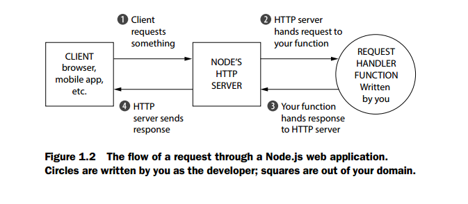

# 1.1 What is this Node.js business？

Node.js is not child’s play. When I first started using Node.js, I was confused. What is it?

Node.js (often shortened to Node) is a JavaScript platform—a way to run JavaScript.
Most of the time, JavaScript is run in web browsers, but there’s nothing about the
JavaScript language that requires it to be run in a browser. It’s a programming language just like Ruby or Python or C++ or PHP or Java. Sure, there are JavaScript runtimes bundled with all popular web browsers, but that doesn’t mean that it has to be
run there. If you were running a Python file called myfile.py, you would run pythonmyfile.py. But you could write your own Python interpreter, call it SnakeWoman, and
run snakewoman myfile.py. Its developers did the same with Node.js; instead of typing
javascript myfile.js, you type node myfile.js.

Running JavaScript outside the browser lets you do a lot—anything a regular programming language could do, really—but it’s mostly used for web development.

Okay, so you can run JavaScript on the server—why would you do this?

A lot of developers will tell you that Node.js is fast, and that’s true. Node.js isn’t the
fastest thing on the market by any means, but it’s fast for two reasons.

The first is pretty simple: the JavaScript engine is fast. It’s based on the engine used
in Google Chrome, which has a famously quick JavaScript engine. It can execute
JavaScript like there’s no tomorrow, processing thousands of instructions a second.

The second reason for its speed lies in its ability to handle concurrency, and it’s a
bit less straightforward. Its performance comes from its asynchronous workings.

The best real-world analogy I can come up with is baking. Let’s say I’m making
muffins. I have to prepare the batter and while I’m doing that, I can’t do anything
else. I can’t sit down and read a book, I can’t cook something else, and so on. But
once I put the muffins in the oven, I don’t have to stand there looking at the oven
until they’re done—I can do something else. Maybe I start preparing more batter.
Maybe I read a book. In any case, I don’t have to wait for the muffins to finish baking
for me to be able to do something else.

In Node.js, a browser might request something from your server. You begin
responding to this request and another request comes in. Let’s say both requests have
to talk to an external database. You can ask the external database about the first
request, and while that external database is thinking, you can begin to respond to the
second request. Your code isn’t doing two things at once, but when someone else is
working on something, you’re not held up waiting.

Other runtimes don’t have this luxury built in by default. Ruby on Rails, for example, can process only one request at a time. To process more than one at a time, you
effectively have to buy more servers. (There are, of course, many asterisks to this claim.)

Figure 1.1 demonstrates what this might look like.

------
[上一页](1-1-0-What_Is_Express.md)

[下一页]()