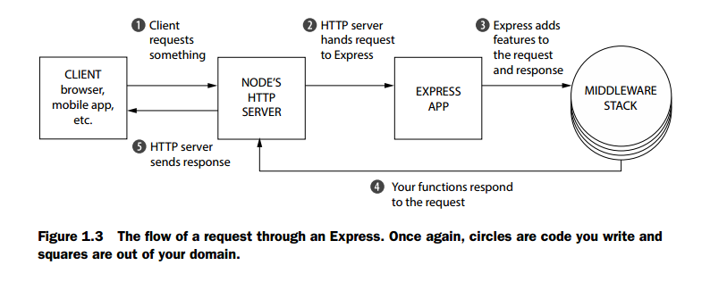

# 1.2 Express 是什么？

[Express is a relatively small framework that sits on top of Node.js’s web server functionality to simplify its APIs and add helpful new features]Express 是一个位于Node.js的web服务功能顶层的，相对较小的框架。简化了它的API并且添加了有用的新特性。它通过中间件和路由使你更加容易管理应用的功能；它向Node.js的HTTP对象加入了有用的工具；它使得渲染动态HTML视图更加容易。

### 1.2.1 [The functionality in Node.js] Node.js中的功能性（或者是函数性？）

当你正在创建一个Node.js web应用（更准确地说，一个web服务器），写了一个JavaScript函数作为整个应用。这个函数监听web浏览器的请求，或者这个请求是来自移动应用的，来使用你的API，又或者其他与你的服务器对话的客户端。当一个请求到来的时候，这个函数会接受这个请求并考虑如何响应。举例，如果你在web浏览器查看主页，这个函数会判断你想要主页，并且它会返回一些HTML。如果你向终端API发送了一个消息，这个函数会考虑你想要什么并且返回JSON数据（举例）。

想象一下你正在写一个告诉人们时刻和时区的web应用。它会像下面这样工作：

- 如果客户端请求主页，你的应用会返回一个HTML，展示时间。
- 如果客户端请求其他的，你的应用将返回一个HTTP 404 “Not Found” 错误和一些附加文本。

如果你在Node.js之上编写你的应用，没有使用Express的话，客户端请求你的服务器时，就像figure 1.2展示的那样

你的应用上处理浏览器请求的JavaScript函数被称作（request handler）请求处理器。 它没有什么太特别的地方；它是一个获取请求，然后弄清楚需要做什么，然后响应请求的这么一个函数。Node.js的HTTP服务器处理了客户端和你的JavaScript函数之间的连接，因此你无须处理那些棘手的网络协议。

在代码层面，就是一个函数，取得了两个参数：一个表示请求的对象，和一个表示响应的对象。在你的 时刻/时区应用里，请求处理函数可能会检查客户端请求的URL。如果你正在请求主页，请求处理函数应该响应一个包含当前时刻的HTML页面。否则，它应该返回404。所有的Node.js应用都像这样：一个单独的请求处理函数，去响应请求。概念上讲，它相当简单。

问题在于Node.js的API会很复杂。想要发送一个JPEG文件？那大概是45行代码。想要创建一个可重用的的HTML模板？想想如何自己实现。Node.js的HTTP服务器很强大，但是如果你想编写一个实际应用的话，它少了很多你可能需要的特性。

Express就是为了让编写Node.js web应用更简单而生的。

### 1.2.2 Express对Node.js增加了什么

粗略地讲，Express为Node.js增加了两大特性：
- 它增加了很多便利性的东西到Node.js的HTTP服务器，将很多复杂性抽象化了。例如，发送一个JPEG文件在原生Node.js中相当复杂（[(especially if you have performance in mind]尤其是如果你还需要考虑性能的时候）;Express将它减少到一行。
- 它让你将一个庞大的请求处理函数重构成许多小的请求处理器，它们只处理指定的一些细节。这样更加可维护也更加模块化。

对比figure 1.2，figure 1.3展示了一个请求将如何经过一个Express应用。

Figure 1.3 可能看着更加复杂了，但对于作为开发者的你来说，这（开发起来）简单多了。实际上这里发生了两件事：

- Express 让你写许多小的函数（许多可能是第三方函数，不需要你亲自写）而不是一个庞大的请求处理函数。有些函数在每次请求时都会执行（例如，某个函数记录了所有请求），有些自二十在某些时候才执行（例如，某个函数仅处理主页或者404页面）。Express有许多工具，来对这些较小的请求处理函数进行分区隔离。

- 请求处理函数获取两个参数：request 和 response。Node.js的HTTP服务器提供一些功能；例如，Node.js的HTTP服务器可以让你在它的某个变量中扩展浏览器的用户代理。Express通过添加扩展特性来增强，比如可以很容易访问请求的IP地址和改进URL的解析。response对象也得到加强；Express添加一些像sendFile的方法，一个只有一行的命令，最后将转换成大概45行的复杂文件代码。这使得它很容易写这些请求处理函数。

你将写多个小的，由请求处理函数，Express和它提供的简便的API使得你写这些函数更舒适，而不是管理一个庞大的繁琐的Node.js API写的请求处理函数

------
[上一页](1-1-1-What_is_this_Nodejs_business.md)

[下一页](1-1-3-Express's_minimal_philosophy.md)